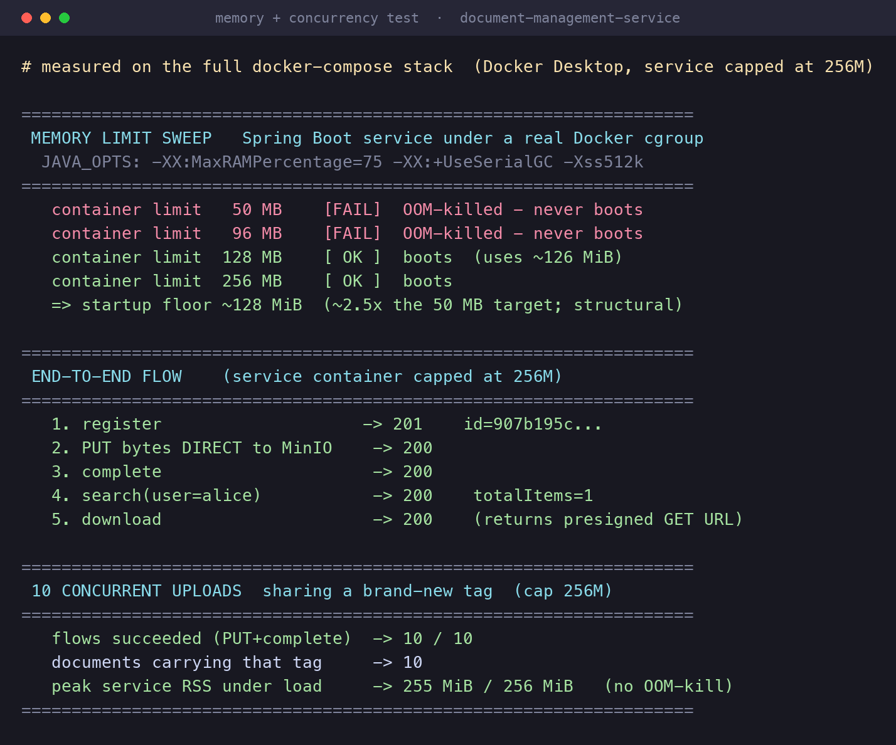

# Document Management Service

Backend service to upload, search, and download large PDF documents (up to 500 MB) under a tight container memory budget. Java 17, Spring Boot 3, PostgreSQL (metadata), MinIO (object storage).

Uploads are **presigned**: clients PUT bytes straight to MinIO, so file data never flows through the service. That is what makes **10 concurrent 500 MB uploads** achievable by design — the bytes never pressure the service's memory. The **50 MB target itself, however, is not reachable on the JVM**; it was measured, not assumed. See [Memory: the 50 MB constraint](#memory-the-50-mb-constraint) for the evidence and the decision.

- Approach, rationale, and trade-offs: [SOLUTION.md](SOLUTION.md)
- Original assignment: [docs/CHALLENGE.md](docs/CHALLENGE.md)

## Architecture

Controller → Service → Repository, with a `StoragePort` abstraction over MinIO (`MinioStorageAdapter`) so the storage backend can be swapped without touching the service. Tags are a normalized many-to-many. Two MinIO endpoints are used: an internal one for server-side `statObject`/`removeObject`, and a public one only to sign URLs the external client can reach.

Upload is a two-step flow:

1. `POST /upload` (JSON metadata) — persists the document as `PENDING`, returns a presigned PUT URL.
2. Client PUTs the PDF directly to that URL (→ MinIO).
3. `POST /upload/{id}/complete` — validates real size/type via `statObject`, marks it `COMPLETED`.

## API

Base path `/document-management`. Contract: [OpenAPI spec](docs/document-management-open-api.yml).

| Method |          Path           |                      Purpose                       |
|--------|-------------------------|----------------------------------------------------|
| POST   | `/upload`               | Register metadata, return a presigned PUT URL      |
| POST   | `/upload/{id}/complete` | Confirm the upload, mark it `COMPLETED`            |
| POST   | `/search`               | Filter by user/name/tags, with pagination and sort |
| GET    | `/download/{id}`        | Return a temporary presigned GET URL               |
| GET    | `/actuator/health`      | Liveness/readiness                                 |

Search returns `COMPLETED` documents only, ordered by `created_at` descending unless a `sort` is given. Multi-tag filtering uses AND semantics (a document must carry every requested tag).

## Memory: the 50 MB constraint

The challenge assigns the service container a **50 MB memory limit**. I treated it as something to measure, not assume — and the measurement is unambiguous: **a Spring Boot + Hibernate JVM cannot run in 50 MB.**

**What happened.** With the file bytes already out of the service (presigned PUT), the only thing left consuming memory is the JVM itself. I ran the app under decreasing container limits (SerialGC, container-aware heap sizing) and recorded where it boots:

|  Container limit   |         Result         |
|--------------------|------------------------|
| 50 MB              | ❌ OOM — never boots    |
| 96 MB              | ❌ OOM — never boots    |
| 128 MB             | ✅ boots (uses ~126 MB) |
| 160 / 200 / 256 MB | ✅ boots                |

The startup floor is ~128 MB — about **2.5× the target** — driven by metaspace (the Spring/Hibernate class graph), a minimum heap, and JVM native memory. It is structural, not a tuning problem: `-Xmx50m` alone (which most reference solutions use) only caps the heap and still never boots under a real 50 MB cgroup.

**Decision.** Ship on a tuned JVM at a realistic **256 MB** limit and document the blocker with evidence rather than fake a number — the challenge explicitly asks to explain blockers. GraalVM native image (~40–90 MB) is the documented production evolution if the limit becomes hard.

**Concurrency still holds.** Because bytes never enter the service, **10 parallel uploads succeed 10/10** with the service stable under 256 MB — verified against the full stack and by an automated `ConcurrentRegisterIT`.



Full detail and raw numbers: [docs/memory-measurement.md](docs/memory-measurement.md).

## Run

All configuration is externalized via environment variables (see [docker/docker-compose.yml](docker/docker-compose.yml) and [application.yml](src/main/resources/application.yml)).

```bash
cd docker && docker-compose up --build
```

Exercise the flow:

1. `POST /document-management/upload` with `{"user","name","tags"}` → receive `id` and `uploadUrl`.
2. `PUT` the PDF bytes to `uploadUrl`.
3. `POST /document-management/upload/{id}/complete`.
4. `POST /document-management/search` and `GET /document-management/download/{id}`.

## Tests

```bash
./mvnw clean verify
```

Runs unit tests plus Testcontainers integration tests against real PostgreSQL and MinIO. Coverage: `./mvnw jacoco:report`. Formatting: `./mvnw spotless:apply`.

## Notes

Conscious decisions (full detail in [SOLUTION.md](SOLUTION.md)):

- Memory: the 50 MB limit is not reachable on the JVM (measured, floor ~128 MB); the service ships at a realistic 256 MB. See [Memory: the 50 MB constraint](#memory-the-50-mb-constraint).
- The presigned flow deviates from the contract's body-less `201` and adds a `/complete` endpoint.
- Validation is minimal by design (metadata plus size ≤ 500 MB); the service never sees the bytes, so there is no content inspection.

## Docs

- [docs/CHALLENGE.md](docs/CHALLENGE.md) — original challenge brief
- [SOLUTION.md](SOLUTION.md) — approach, rationale, trade-offs
- [docs/document-management-open-api.yml](docs/document-management-open-api.yml) — API contract
- [docs/minio-local-setup.md](docs/minio-local-setup.md) — MinIO local setup
- [docs/memory-measurement.md](docs/memory-measurement.md) — memory measurement evidence

